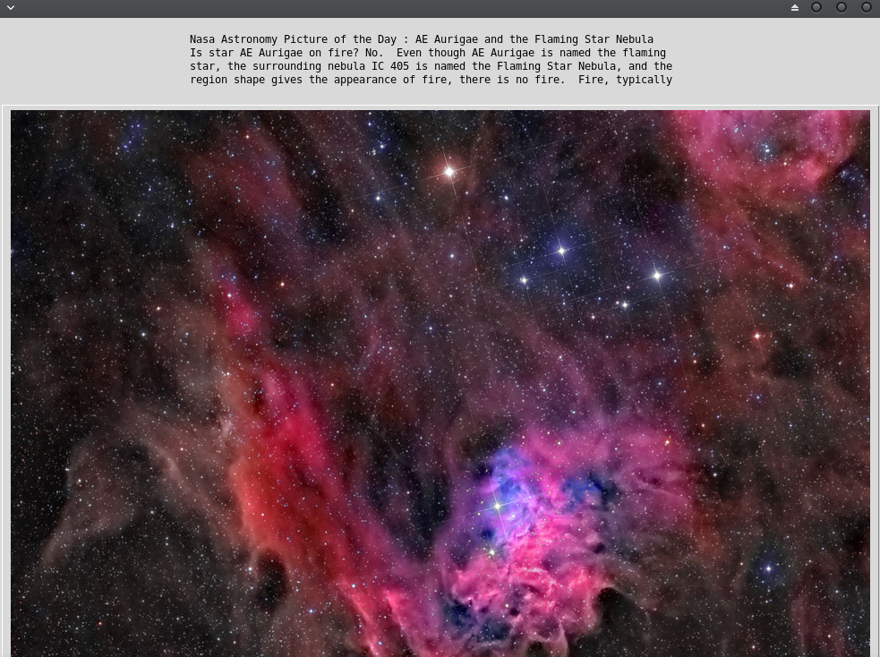

   

# Nasa Picture of the day


## What's this software ?  

This python 3 software parse a json file and download the image of the day and the description of the image from the Nasa.

The data is downloaded from : https://apod.nasa.gov/apod/astropix.html

The complete description of the image is displayed in the terminal with the link of the HD image.
     


## Download the Windows .exe version :

You can run it with Python 3 and the right libraries or for Windows you can use the .exe software that I created there :

[](https://sourceforge.net/projects/nasa-picture-of-the-day/files/latest/download)
[](https://sourceforge.net/projects/nasa-picture-of-the-day/files/latest/download)

## What you need to make it work :  

You need to have an Api key from the Nasa. You can have a free key there :

https://api.nasa.gov/index.html#apply-for-an-api-key

Modify this line with your key :

Put the key between the " " without space.

```sh
apikey = "Enter-your-api-key-here" 
```


The last version of Python 3.

you also need to have the easygui library for python 3:

At least the version 0.98

```sh
sudo python3 -m pip install --upgrade easygui 
```
You need wget for python 3:


```sh
sudo pip3 install wget
```

## How to launch this software :  

```sh
python3 nasapod.py
```  

## Requirements :

If you miss a module, install it with the command pip install module-name. For example if you miss PIL you can install it with : sudo pip3 install pillow.

Your user must have read and write access on the current running 
directory.

## Video not a picture:

Now the software open your default web browser to read the video.

## Developer - Author

Hamdy Abou El Anein

## Homepage

http://www.daylightlinux.ch 
